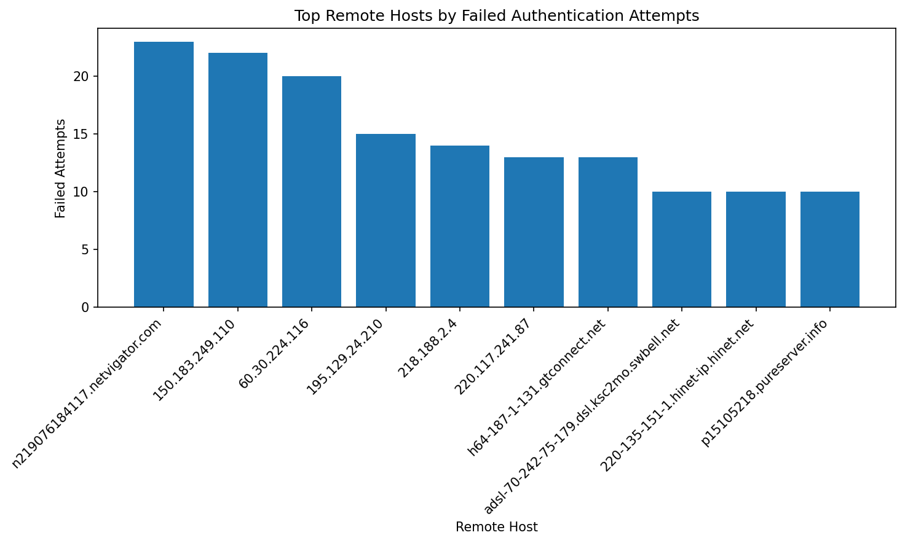
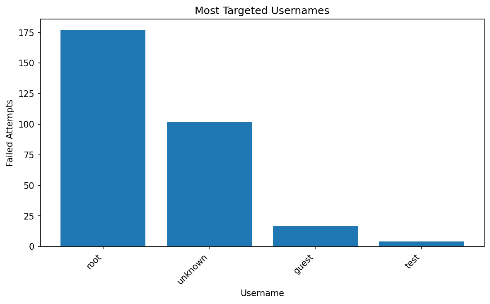
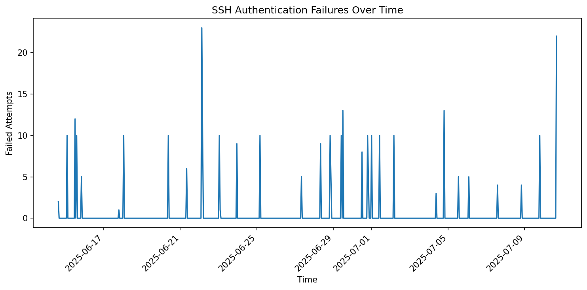

# Brute Force Detection Dashboard

A Python-based cybersecurity project that analyzes SSH authentication logs to detect brute-force login attempts and visualize suspicious activity.

This project builds on log analysis by introducing threat detection and visual investigation, similar to tasks performed by SOC analysts.

## Project Overview

Brute-force attacks involve repeated login attempts to gain unauthorized access. These attacks can be detected by analyzing authentication logs for patterns such as:

repeated failed login attempts from the same host

multiple attempts targeting specific usernames

spikes in login failures over time

This project parses SSH authentication logs and generates:

detection results

visual dashboards

investigation reports

## Features

Parses SSH authentication failure logs

Identifies hosts with repeated login failures

Detects potential brute-force activity using thresholds

Analyzes targeted usernames

Visualizes attack patterns using charts

Generates investigation reports

## Project Structure
```
brute-force-detection-dashboard
│
├── data
│   └── ssh_auth_sample.log
│
├── outputs
│   ├── failed_attempts_by_host.png
│   ├── targeted_users.png
│   ├── attack_timeline.png
│   └── brute_force_report.txt
│
├── src
│   └── brute_force_dashboard.py
│
├── requirements.txt
├── README.md
└── .gitignore
```
## Installation

Clone the repository:
```
git clone https://github.com/wivalconcept/brute-force-detection-dashboard.git
cd brute-force-detection-dashboard
```
Install dependencies:
```
pip install -r requirements.txt
```
## Usage

Run the dashboard script:
```
python src/brute_force_dashboard.py -i data/ssh_auth_sample.log -o outputs
```
Optional: adjust detection threshold
```
python src/brute_force_dashboard.py -i data/ssh_auth_sample.log -o outputs -t 5
```
### Detection Logic

A remote host is flagged as suspicious if it exceeds a defined number of failed login attempts.

Default threshold:

3 failed attempts

This simulates basic brute-force detection used in security monitoring.

## Visualizations
Failed Attempts by Host

Most Targeted Usernames

Attack Timeline

Example Output

The tool generates:

summary report of authentication failures

list of suspicious hosts

breakdown of targeted usernames

timeline of login attempts

## Visualizations

### Failed Attempts by Host


### Most Targeted Usernames


### Attack Timeline


## Skills Demonstrated

This project demonstrates:

Log analysis

Threat detection

Python scripting

Data analysis with Pandas

Data visualization with Matplotlib

Security investigation techniques

Future Improvements

Time-based brute-force detection (burst analysis)

Integration with threat intelligence APIs

Real-time log monitoring

Alerting system for suspicious activity

## Author
Valentine Chukwunwike Cybersecurity Analyst | SOC | Threat Detection | Log Analysis


